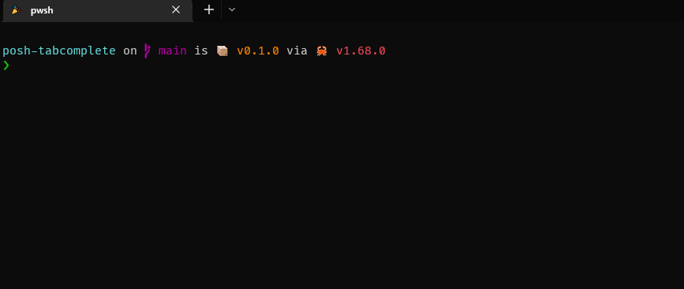

# posh-tabcomplete
[](https://crates.io/crates/posh-tabcomplete)
[](https://github.com/domsleee/posh-tabcomplete/actions/workflows/ci.yml)

Blazing fast tab completion for powershell and pwsh.



Features:
* Fast startup and execution using [nushell/nu-engine](https://crates.io/crates/nu-engine)
* Extendable using `.nu` files, with built in support for commmon tasks like `git` and `npm run`
* Supports all platforms. Tested on windows, WSL, mac and linux

By default, [completions.nu](./resource/completions.nu) is used. An alternative `.nu` file can be specified in the `TABCOMPLETE_FILE` environment variable.

## Installation

### Step 1. Install binary

There are binaries available in [releases](https://github.com/domsleee/posh-tabcomplete/releases) or with one of these commands:

| Repository      | Instructions                             |
| --------------- | ---------------------------------------  |
| **[crates.io]** | `cargo install posh-tabcomplete --locked`|


### Step 2. Setup powershell

Add this line to your profile, you can edit this by typing `code $PROFILE` in powershell:
```pwsh
Invoke-Expression (&posh-tabcomplete init | Out-String)
```

[crates.io]: https://crates.io/crates/starship

## Built in completions
The completions packaged with the binary in [completions.nu](./resource/completions.nu) are:
* [git completions](https://github.com/nushell/nu_scripts/blob/main/custom-completions/git/git-completions.nu). These are also combined with [git auto generated completions](https://github.com/nushell/nu_scripts/blob/main/custom-completions/auto-generate/completions/git.nu)
* [npm completions](https://github.com/nushell/nu_scripts/blob/main/custom-completions/npm/npm-completions.nu)
* [cargo completions](https://github.com/nushell/nu_scripts/blob/main/custom-completions/cargo/cargo-completions.nu)

## Benchmarks
To run these, run `./benchmark/benchmark_all.ps1`

Benchmark | Results
----------|-----------
`benchmark/init` - startup time | posh-tabcomplete: 102ms, posh-git: 432ms (4.24x faster)
`benchmark/complete` - tab completion (100 branches) | posh-tabcomplete: 71ms, posh-git: 172ms (2.42x faster)

## Aliases / Function support
Functions are supported. For example, the completion of `gco` in the demo is:
```pwsh
function gco() { git checkout $args }
```

There is no support for alias completions at this time.